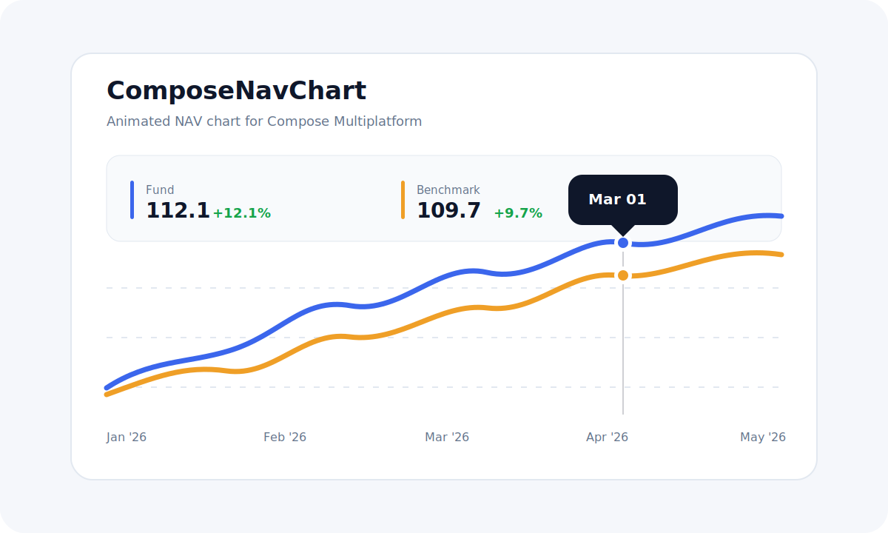
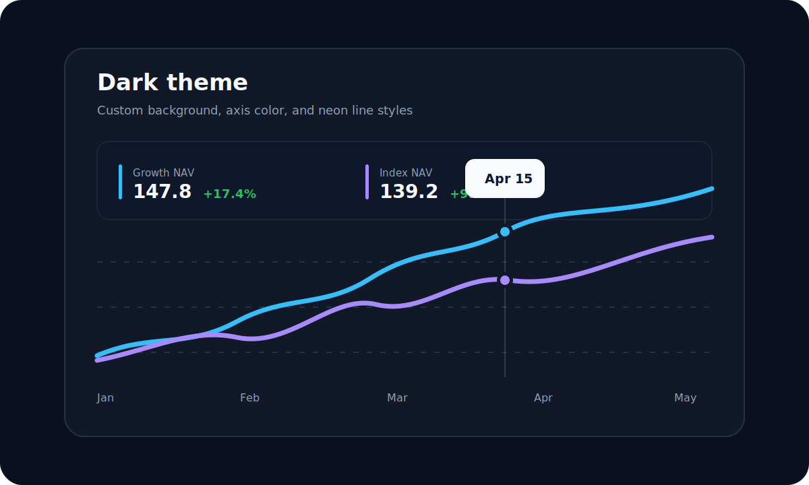
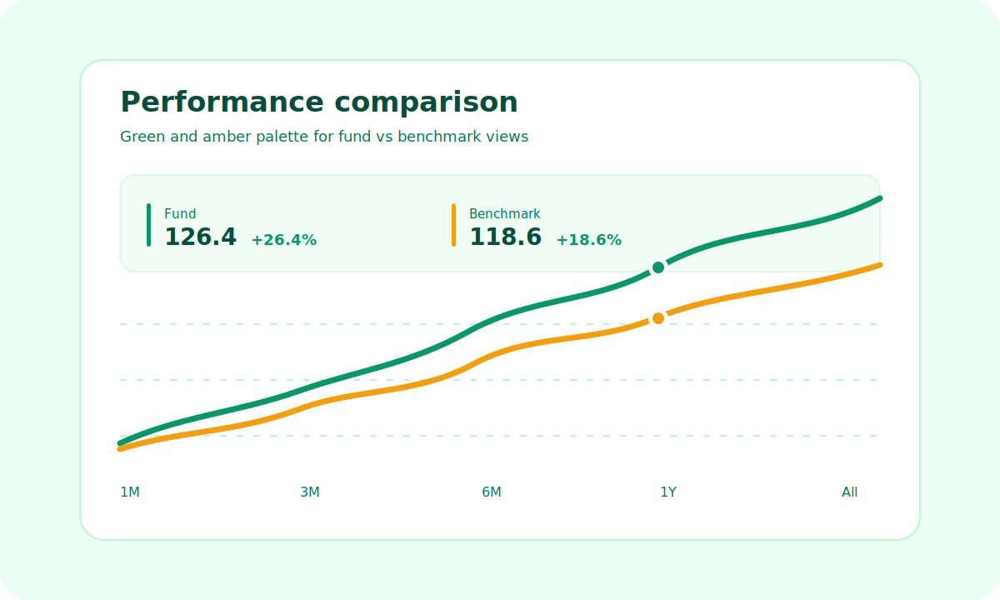
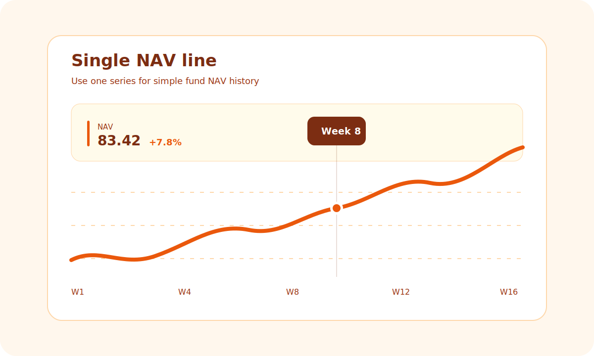
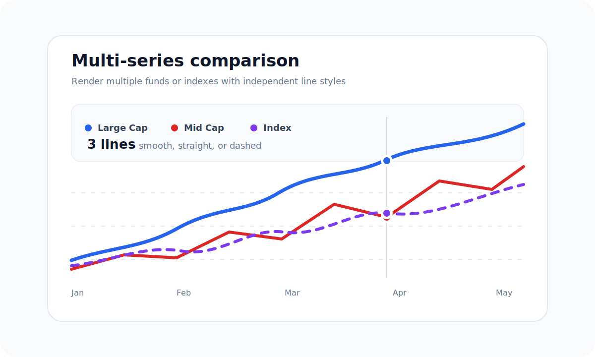

# ComposeNavChart

A small Compose Multiplatform library for rendering animated NAV charts on Android and iOS.

The chart is extracted from a production portfolio graph and made reusable with neutral data models, configurable line styles, date labels, tooltips, and scrub interaction.

## Preview



## Variations

| Default | Dark |
| --- | --- |
|  |  |

| Emerald | Single line |
| --- | --- |
|  |  |

| Multi-series |
| --- |
|  |

## Install

Add Maven Central to your repositories:

```kotlin
repositories {
    google()
    mavenCentral()
}
```

Then add the dependency:

```kotlin
commonMain.dependencies {
    implementation("io.github.samarthraj11:compose-nav-chart:0.2.2")
}
```

## Usage

```kotlin
@Composable
fun PortfolioChart() {
    ComposeNavChart(
        series = listOf(
            NavSeries(
                name = "Fund",
                points = listOf(
                    NavPoint(timestampMillis = 1_767_225_600_000L, value = 100.0),
                    NavPoint(timestampMillis = 1_769_904_000_000L, value = 108.4),
                    NavPoint(timestampMillis = 1_772_323_200_000L, value = 112.1),
                ),
            ),
            NavSeries(
                name = "Benchmark",
                points = listOf(
                    NavPoint(timestampMillis = 1_767_225_600_000L, value = 100.0),
                    NavPoint(timestampMillis = 1_769_904_000_000L, value = 105.2),
                    NavPoint(timestampMillis = 1_772_323_200_000L, value = 109.7),
                ),
            ),
        ),
        onScrubChange = { points ->
            // Update legend values while the user drags over the chart.
        },
    )
}
```

## License

Apache License 2.0
